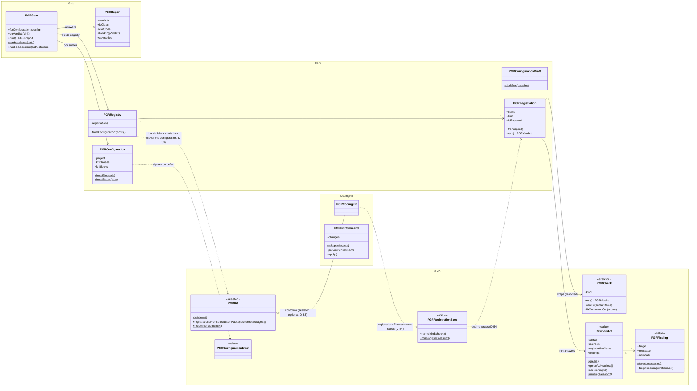
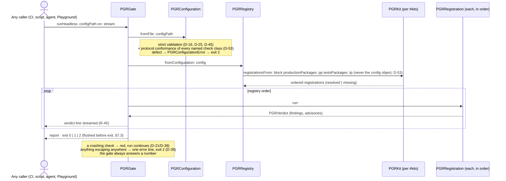

# Spec ch. 0 — Architecture: the floor plan the chapters fulfill

*Standing cross-chapter artifact, beside the glossary. Backfilled at Gate-2 close: the
review's major corrections (the invocation model, coupling, statefulness, the public-API
gap) were system-level facts owned by no chapter — this document owns them. Extraction,
not invention: every statement traces to ruled ground (pack P1–P7; D-25, D-39, D-40,
D-41, D-45, D-46, D-47, D-48; R-04, R-05, R-35, R-47; §4.4's layer map). Section layout
and table shapes are agent details, veto-open (D-16 precedent).*

## 0.1 Component map

| Component | Packages | May depend on (of ours) | Role |
|---|---|---|---|
| **SDK** | `Phi-Guardrails-SDK` | nothing | the published boundary (D-53): protocol declarations, the two optional skeletons (`PGRCheck`, `PGRKit`), the frozen vocabulary (`PGRVerdict`, `PGRFinding`, `PGRRegistrationSpec` — D-54, `PGRConfigurationError`, the three fix-invocation errors) — no SUnit, no Renraku, no engine vocabulary (R-04) |
| **Core** | `Phi-Guardrails-Core` | sdk | the engine: configuration parsing/validation, registry, registration machinery, the authoring-time draft tool |
| **Gate** | `Phi-Guardrails-Gate` | core, sdk | runs a registry, aggregates the report, owns the headless entry and exit codes |
| **Coding kit** | `Phi-Guardrails-Coding`, `-Coding-Rules`, `-Coding-Architecture`, `-Coding-Behavioral` | **sdk only — never the engine** (D-53) | check classes, their engines (Renraku, rewriter, SUnit runner, reflective queries), its published stanza (≡ recommended block, D-51) |
| **Fixtures / toy** | `Phi-Guardrails-Fixtures-*`, `Phi-Guardrails-Toy-*` | (exempt-role demonstration matter) | committed-red fixtures and the demo client; referenced by no production package |
| **Tests** | `Phi-Guardrails-Tests-*` (incl. `-Tests-Toy`, D-46) | anything they test | mirror suites and the toy demo test |
| **Reference runner** | `guardrails.sh` (+ image-assembly recipe, §7.3) | — (outside the image) | one caller among many; must not re-privilege any caller (D-45 ruling 4) |

The one-way arrows — `core → sdk`, `gate → core`, `gate → sdk`, `kit → sdk`, and
**nothing else** (never `sdk → anything`, never `gate → kit`, never `kit → core`: the
walls that keep checking away from fixing, SUnit/Renraku out of the boundary, and kits
off the engine, D-53) — are not this document's opinion: they **are §4.4's
machine-checked layer map**, prose-ified. Enforcement: the framework's own registered
layer-map check plus P-CORE-NEUTRAL, P-FIX-GATE-WALL, P-SDK-EDGE, P-DETERMINISTIC
(ch. 9). Kits answer **`PGRRegistrationSpec`** values (SDK vocabulary) and the engine
wraps them into its internal `PGRRegistration` — *the boundary carries information; the
engine owns mechanism* (D-54, closing D-53's residency question).

**Object diagram** (verified against §1.3/§1.4/§7.2; visibility markers carry
D-48/D-49, so this doubles as the surface map). A color-coded SVG rendering — members
tinted by *audience*, the same information the markers carry, made scannable — sits
beside this file: `00-architecture-object-diagram.svg`. The two views are kept
identical; amend both or neither:

*Legend:* `+` public — on an audience surface per §0.3 (D-48, gaps ruled by D-49:
construction and verdict/finding readers → caller; `PGRFixCommand` → the fifth
audience, *fix invoker*; the role-package accessors, elided
for size, are the kit-author reading half) · `~` internal, may change without notice ·
`$` class-side · `«skeleton»` optional superclass — conformance, not ancestry, is what
registration requires (D-53) · `«value»` frozen boundary vocabulary in
`Phi-Guardrails-SDK` (the fix-invocation errors are `-SDK` vocabulary too, elided).
Verdict readers `kind`/`durationMillis` and `advisories` are
caller-surface too, elided for size (§0.3; the `scope` field left with the two-scope
model, D-51). `PGRVerdict class>>skipped` exists (§1.3)
but is deliberately absent here: check authors must never emit it (D-21/D-32).
`PGRFixCommand` is outside the gate's
call graph by construction (P-FIX-GATE-WALL) — no arrow from Gate may ever reach it.

## 0.2 The invocation model (P7, D-45)

Normative diagram: `../phi/method/guardrails-invocation-model.svg`.

- **Who may call:** anyone or anything — a developer in a Playground, a CI job, a shell
  script, an agent or harness, another tool. **No caller is privileged and none is
  required.** The gate starts nothing.
- **What a target repo contains:** one configuration file (R-47). Adoption changes
  nothing in the target's source, baseline, or tests; the config need not even live in
  the target repo (D-45 ruling 1 — no default location, explicit path always).
- **What the gate answers:** one verdict per registration, streamed as produced (R-45);
  one report; one exit code — `0` clean · `1` ≥1 non-green verdict · `2` configuration
  error or any escaped exception ("the run produced no verdict", D-39). The reference
  runner's wrapper treats any exit code that is not exactly 0, 1, or 2 as failure.
- **Residual caveat (D-45):** a swept test must not invoke the gate on its own repo's
  config — the recursion is no longer designed against, only advised against. (Running
  the gate on *another* config from a swept test nests and terminates — the D-46
  argument.)

**Call flow, the headless run** (verified against §1.4 and §7.1–§7.3):

## 0.3 The public surface: four SDKs and a schema (D-48/D-49 recomposed by D-53)

The boundary ships as **`Phi-Guardrails-SDK`** (ruling D-53.3): the protocol
declarations, the two optional skeletons, and the frozen vocabulary. Each SDK below is
**complete** (everything its audience needs) and **minimal** (nothing else) — that pair
is the test any surface change must pass. **Conformance, not ancestry:** the check and
kit contracts are *protocols* (message sets + behavioral expectations); `PGRCheck` and
`PGRKit` are optional skeleton superclasses, and registry construction validates
conformance before any check runs (§1.4).

**Producer side (nested):**

| SDK | Contents |
|---|---|
| **Check-author SDK** | the check **protocol**: `run` → verdict, `kind`, and the fix capability, two messages (D-54): `canFix` (skeleton default false) + `fixCommandOn:` (required when `canFix`; answers an object conforming to the fix-invocation protocol — spellings veto-open, shape ruled); the `PGRVerdict` constructors (`green`, `greenAdvisories:`, `redFindings:`, `missingReason:`); the `PGRFinding` constructors (`target:message:`, `target:message:rationale:`); class-side `severity` mandatory for registered lint rules (D-41); the fixture-pair requirement (R-37/R-46) |
| **Kit-author SDK** | contains the Check-author SDK, **plus** the kit **protocol**, three messages (D-53/D-54) — `kitName` · `registrationsFrom:productionPackages:testsPackages:` (its verbatim block + the resolved role package lists; **never the configuration object** — over-reach is impossible, not caught) answering **`PGRRegistrationSpec`** values · `recommendedBlock` (the published stanza, single-sourced on the class; the init tool composes from it, docs quote it — self-validated by P-STANZA-VALID) — plus the `PGRRegistrationSpec` constructors (`name:kind:check:` / `missing:kind:reason:`) |

**Consumer side (split by mutation rights):**

| SDK | Contents |
|---|---|
| **Gate-caller SDK** | **read-only — contains no mutating message by construction**: `PGRGate class>>runHeadless:` / `runHeadless:on:` + the exit-code contract (§7.3); in-image `forConfiguration:`, `run`, `onVerdict:`; construction `PGRConfiguration class>>fromFile:` / `fromString:`; `PGRReport>>verdicts`, `isClean`, `exitCode`, `blockingVerdicts`, `advisories`; reading `PGRVerdict>>status`, `isGreen`, `registrationName`, `kind`, `durationMillis`, `findings`, `advisories` and `PGRFinding>>target`, `message`, `rationale`; `PGRConfigurationError` catchable by class (message *text* human-facing, not an API) |
| **Fix-invoker SDK** | **mutating, preview-first**: the generic fix-invocation protocol, hoisted to `-SDK` (D-53.4) — construct → `previewOn:` → `apply` → `changes`, staleness detection required, the three catchable errors (`PGRNotAutofixable` — renamed generic by D-54, `PGRFixNotPreviewed`, `PGRFixStale`). `PGRFixCommand` is the coding kit's *implementation* over methods/RB/Epicea; a future kit fixes over its own medium. **P-FIX-GATE-WALL, restated at SDK level: no path from the gate-caller surface reaches fix invocation** |

**Config author** — not a code SDK: the `guardrails.ston` schema (§1.1; kit-block keys
chs. 2–5), `#schemaVersion` + the versioning policy (ch. 1 owns it), and **the init
tool** — `PGRConfigurationDraft class>>draftFor:` (a dedicated authoring-time class,
D-53.6; `PGRConfiguration` is purely run-time) → draft STON composing the kits'
published stanzas, for human review; generation may guess, the gate never infers.

**Blessed data-crossing (D-53.1):** `PGRVerdict`/`PGRFinding` appear in two SDKs by
design — the check author constructs (class side), the caller reads (instance side).
That is the boundary's vocabulary doing its job, not coupling.

**The law:** everything not named in these surfaces is **internal and may change without
notice**. The M1 freeze applies to these surfaces, not to internals (§1.3's table is
annotated accordingly). **The report's printed text is human-facing and explicitly not
an API** — the machine contract is the exit code and the artifact schema. Cold
readability of every surface — error text, findings, report — is a product requirement
(D-45 ruling 5), product-tested by §8.4's external-adoption proof.

## 0.4 System invariants (owned here; enforced in ch. 9)

- **Runs share nothing** — every gate run builds its registry and caches fresh and
  discards them; nested runs included (D-46). No global state, ever (R-35). →
  P-REG-FRESH.
- **Silence never passes** — an unresolvable check, an empty expansion, a zero-match
  matcher, an unassigned package: each is missing or a configuration error, never a
  quiet green (R-24, D-25, D-45). → P-GATE-MISSING, P-SCOPE-TOTAL, P-ROLES-FROM-CONFIG.
- **The configuration file is the complete statement of what runs** — kits ship no
  defaults and the core merges nothing (D-51): what runs is exactly what the file
  names (plus the role-derived suites), so a framework upgrade cannot change a
  project's enforcement without a visible diff in that project's own repo (P6
  strengthened). → P-GATE-COMPLETE, P-LOADING-INERT.
- **The gate never ends without deciding a number** — per-registration errors are red;
  anything escaping anywhere else is caught at top level and answers 2 (D-39). →
  P-ERR-IS-RED, P-NEVER-UNDECIDED, P-EXIT-CODES.
- **Checking never mutates** — the gate reads; only the explicitly invoked fix command
  writes, and the layer map makes the gate structurally unable to reach it (R-12,
  D-06, D-42). → P-GATE-PURE, P-FIX-GATE-WALL.
- **Loud failure over inference** — strict validation (D-16), no default path, no
  environment sniffing, refuse newer schemas, no anchor-less relative paths (D-45,
  D-47). Generation may guess (the init command); the run-time gate may never infer. →
  P-CFG-STRICT, P-NO-DEFAULT-PATH, P-SCHEMA-REFUSAL.
- **Agnosticism in both directions** — the framework never names a client (R-05); the
  client never operates its own gate (P7, R-47). → P-CORE-NEUTRAL; R-47's adoption
  test (§8.4).
- **Conformance is validated before any check runs** — registration requires protocol
  conformance, not ancestry (D-53): a named, loaded class that does not respond to its
  protocol is a configuration error naming the class and the missing selector, at
  registry construction — never a strange failure mid-run. → P-CONFORMANCE.
- **Validation is independent of enforcement** — the tests that prove the checks work
  never run through the gate, so a gate defect cannot suppress the tests that detect
  it: CI loads committed source, meaning a changed gate is judged by the changed gate —
  the independent step is the only unswallowable witness (D-40, compressed). →
  P-JUDGE-CONVICTS, P-SELF-HOSTED.

## 0.5 The fulfillment rule

**Every chapter implements named elements of this document. A chapter that needs
something the architecture does not provide changes the architecture first — visibly,
via a ruling — never by silent workaround.** This table is the single index; chapter
headers carry no back-references.

| Architecture element | Implementing chapter(s) | Key properties (ch. 9) |
|---|---|---|
| Component map & layering (0.1) | ch. 1 §1.3; ch. 4 §4.4 | P-CORE-NEUTRAL, P-FIX-GATE-WALL, P-DETERMINISTIC |
| Invocation contract (0.2) | ch. 7 §7.3 | P-GATE-HEADLESS, P-NO-DEFAULT-PATH, P-NEVER-UNDECIDED, P-EXIT-CODES, P-SAME-VERDICT |
| Configuration & registry (0.3 config author) | ch. 1 | P-CFG-STRICT, P-SCHEMA-REFUSAL, P-SCOPE-TOTAL, P-ROLES-FROM-CONFIG, P-ROLE-MISFILE, P-LOADING-INERT (P-MERGE-LAW deleted with the merge, D-51) |
| Check kinds & engines (0.1, 0.3 check author) | chs. 2, 3, 4, 5 | P-CAT-AUTOFIX, P-CAT-FIXTURES, P-SEVERITY-EXPLICIT, P-BUILTIN-PINNED, P-FINDING-PRECISE, P-LAYERMAP-TOTAL, P-GATE-SKIP, P-SUITES-BEFORE-META |
| Run semantics: verdicts, order, streaming, error arms (0.4) | ch. 1 §1.4–§1.5; ch. 7 §7.1–§7.2 | P-GATE-COMPLETE, P-GATE-MISSING, P-ERR-IS-RED, P-STREAM, P-GATE-PURE, P-REG-FRESH |
| Validation ∥ enforcement, two CI steps (0.4) | ch. 7 §7.4 | P-JUDGE-CONVICTS, P-SELF-HOSTED |
| Source-inventory guard (0.1 · D-45) | ch. 7 §7.5 | P-NO-DEAD-SRC |
| Public surfaces & the M1 freeze (0.3) | ch. 1 §1.3; ch. 2 §2.2/§2.2b; ch. 3 §3.3; ch. 7 §7.2–§7.3 | P-SURFACE-CONFORMS (D-49) |
| Demonstration & onboarding (0.2) | ch. 8 | P-GATE-RED (with D-43's protections) |
| Reference runner (0.1, 0.2) | ch. 7 §7.3 (v1 home, D-46; revisit at §8.4's proof) | P-WRAPPER-GUARD (D-49 — the CI shell self-test) |
