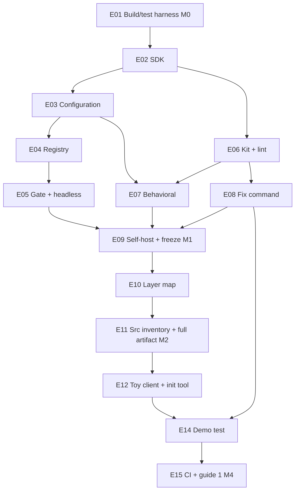

# 03 · Roadmap — phi-guardrails (milestones → epics)

*Produced by Prompt 3 (top-level decomposition). Inputs: `plan/00-constitution.md`,
`plan/01-requirements.md`, `plan/decision-log.md` (D-01…D-60.a), all of
`plan/02-spec/`, `plan/backlog.md`, `docs/quickstarts/` (D-59/D-60). Entry check
passed: sheet 02 fully ruled (Q-18…Q-28 closed, nothing open), every ruling numbered
into the log, coverage reads exactly 37 covered + 1 superseded (R-28 → D-37) = 38
v1-skeleton requirements (the D-38 expectation as corrected at the freeze round), and
the spec text carries the Gate-2 arc (D-45/D-51/D-53–D-57/D-59/D-60) with no surviving
contradiction found in this stage's full read.*

*Amended at the Gate-3 remediation (D-61, 2026-07-22): placement-annotation law
applied to every multi-placed requirement (a) · stream-flush probe front-loaded to
E01 (b) · M5 row struck from §1 (c) · E13 merged into E12 (d) · §4 totals corrected
(e) · R-03 restored to §6 (f).*

*Approved at Gate 3 and **FROZEN at D-62** (2026-07-22): all §7 items confirmed,
every veto-open choice closed on the D-16 precedent. This file is Prompt 4's
frozen input; no further edits without an owner notice.*

## 0 · Shape: how this departs from Pack §8, and why

The pack's M0–M5 sketch predates the architecture arc. Two of its milestones do not
survive re-derivation from the frozen spec:

1. **The pack's M3 (behavioral enforcement) is absorbed into M1 — a forced move, not a
   preference.** The spec makes `#tests` a mandatory role (ch. 1 §1.1) and behavioral
   suite derivation unconditional (ch. 5 §5.1: one registration per tests-role package,
   no block key). The constitution requires the repo's own gate
   (`./guardrails.sh guardrails.ston`) to pass **from M1 onward** (§3, R-38). A valid
   M1 artifact therefore already derives behavioral suite registrations, so
   `PCKTestSuiteCheck` and the run cache are prerequisites of the *first* self-hosted
   run. The no-skips meta-rule rides along (same cache, same fixtures family, and the
   kit's `recommendedBlock` names it — landing it at M1 keeps the stanza single-sourced
   and complete from birth, P-STANZA-VALID).
2. **The label M3 is retired, never reused** (the corpus's stable-ID convention:
   requirement IDs, question IDs, and backlog rows are history). **M4 and M5 keep
   their established meanings**, so every existing reference stays valid verbatim:
   ch. 7 §7.6's "measured at M4" (D-13), guide 1's M4 anchor (D-59 — hereby
   **confirmed**, not moved), and every "M5 (widening)" reference in chs. 2/3/5/8, the
   requirements, and the backlog. Guides 2–3's M1 anchors are likewise **confirmed**.
   The milestone sequence is **M0 → M1 → M2 → M4 → M5**; there is no M3.

Milestone 0 does not shrink: the pack lists no dependencies (§7), so the build/test harness is
built here, permanently installing the D-31.a toolchain that every probe session used.

## 1 · Milestone table

Milestones are strictly sequential: no chunk of the next milestone starts before the
previous checkpoint runs green.

| ID | Name | Goal (one sentence) | Executable checkpoint | Epics |
|---|---|---|---|---|
| **M0** | Build/test harness | An agent can run one trivial green test headlessly from a script on a permanently installed Pharo 13 toolchain, with every open ⟨verify⟩ spelling probed. | Verify command exits 0 on the smoke suite (`Phi-Guardrails-Tests-Core`); the minimal CI workflow (step 1 only) runs green on an actual CI run; probe results recorded in the decision log (D-57 regex · D-58 collisions · D-60.a load expression · D-61.b stream flush). | E01 |
| **M1** | Walking skeleton, self-hosted | The full enforcement path — artifact → registry → gate → report → exit code — runs end-to-end with the lint and behavioral kinds live, the fix command working, all published surfaces frozen, and the framework green under its own gate. | Verify command exits 0 over both tests families **and** `./guardrails.sh guardrails.ston` exits 0 (M1 artifact: two lint rules + no-skips meta-rule + derived suites) **and** `PGRQuickstartSamplesTest>>#testWriteACheckSamples` / `>>#testBuildAKitSamples` are green (P-GUIDE-EXEC, guides 2–3 — anchors confirmed). | E02–E09 |
| **M2** | Architecture kind | The coding kit covers all three check kinds: the layer-map check and the src-inventory check land, and the framework's own artifact reaches its complete §7.5 form — walls machine-enforced by the gate itself. | Both instruments exit 0 over the **completed** §7.5 artifact (five named registrations + derived suites, §4.4 layer map, `#src`); verify command green. | E10, E11 |
| **M4** | Demonstration, init, CI | The skeleton is demonstrated end-to-end against the toy client (red → fixed → green), the init tool drafts configs, and CI runs the two-step contract with the wrapper self-test — the walking skeleton is done. | The committed `.github/workflows/ci.yml` runs green: smalltalkCI step + `./guardrails.sh guardrails.ston` step + P-WRAPPER-GUARD shell self-test; `ToyDemoTest` (in the verify sweep) drives red → fixed → green; `>>#testAdoptAndRunSamples` green (guide 1, M4 anchor confirmed); D-13 timings measured and filed as a decision-sheet entry. | E12, E14, E15 |

*M5 (widening) is deliberately not a row (D-61.c): its scope is recorded in §6 —
not epic-cut; it is cut, and its executable checkpoint defined, by a roadmap
re-entry when M4 closes (§8.4's external-adoption proof remains the exit criterion
for "ready for general client use", D-12 (b)). The table's rule is thereby
absolute: every row's checkpoint is runnable, no exceptions.*

## 2 · Epics

Interface freeze: an epic's exported interfaces freeze at **epic acceptance**; later
epics build on them or file a decision-sheet entry. This is the mapping the sheet-02
amendment note (ii) asked for: **the spec's "frozen at M1" markers mean "frozen at the
exporting epic's acceptance, all in force by M1's checkpoint"** — E02 freezes the SDK
vocabulary and both skeleton protocols, E05 the gate-caller surface and exit-code
contract, E06 the coding kit's block schema, E08 the fix-invocation implementation.
From E09 the freeze is machine-witnessed (P-SURFACE-CONFORMS).

`[P]` = may run in parallel with the epics named, sharing no mutable surface. The
shared-surface hazards were designed out: E01 pre-creates **all package stubs and the
full baseline group tree**, so no later epic edits another's package list; `PCKKit`'s
block-schema dispatch is laid down **complete** in E06 (all four keys recognized;
unnamed classes resolve via the promised `packages:` path), so E07 and E10 each fill
exactly one kind-specific builder, sequentially.

Placement-annotation law (D-61.a): a v1 requirement lands in exactly one epic, or in
several iff **every** occurrence carries a scope annotation naming the part that epic
owes; a bare occurrence of a multi-placed ID is a finding.

---

### E01 · Build/test harness, skeleton, probes — M0
- **Goal:** permanent Pharo 13 headless toolchain (D-31.a); Tonel `src/` skeleton with
  **all** package stubs and `BaselineOfPhiGuardrails` role groups + composites (ch. 8
  §8.1 table); one green smoke test run by the verify command from a script; a minimal
  `.smalltalk.ston` + `.github/workflows/ci.yml` (step 1 only) green on a real CI run;
  the M0 probe pass.
- **Spec:** ch. 8 §8.1 (baseline groups) · ch. 9 §9.3 (verify command) · ch. 7 §7.3–§7.4
  (recipe/workflow seeds, D-60.a landing condition opens here).
- **Requirements:** R-36 (framework + kit families — the Toy family is E12's),
  R-39 (probe discipline).
- **Probes (all recorded as a decision-log entry):** verify-command alternation regex
  `"(Phi-Guardrails|Phi-Coding-Kit)-Tests-.*"` (D-57) · `PCK` prefix, `Toy` prefix,
  `BaselineOfToy` collisions (D-58) · the Metacello load expression / image-assembly
  spellings (D-60/D-60.a — the workflow's load must be the real form of §7.3's) ·
  stream flush before `Smalltalk exit:` headless — a five-line snippet writing to
  stdout then exiting nonzero, run from a script (retires E05's one environment
  uncertainty at M0; D-61.b).
- **Depends on:** — · **[P]:** — · **Chunks:** ~4
- **Frozen exports:** the naming tree as committed (packages, baseline group names).
- **Risk:** all environment uncertainty of the project front-loaded here by design
  (toolchain permanence, CI service, regex dialect, headless stream flush); a failed
  probe becomes a decision-sheet entry before M1 starts.

### E02 · SDK vocabulary and skeletons — M1
- **Goal:** `Phi-Guardrails-SDK` complete: `PGRVerdict`, `PGRFinding`,
  `PGRRegistrationSpec`, `PGRConfigurationError`, `PGRNotAutofixable`,
  `PGRFixNotPreviewed`, `PGRFixStale`, and the two optional skeletons `PGRCheck`
  (`packages:` constructor, `canFix` default false) and `PGRKit` (two-message
  protocol).
- **Spec:** ch. 1 §1.3 (SDK rows) · ch. 0 §0.1/§0.3.
- **Requirements:** R-04 (boundary half), R-40 (i).
- **Properties:** P-CANFIX-DEFAULT (its subject,
  `PGRCheckSkeletonTest>>#testCanFixDefaultsFalse`, lands with the skeleton).
- **Depends on:** E01 · **[P]:** — (everything else builds on it) · **Chunks:** ~5
- **Frozen exports:** the entire SDK vocabulary (constructors + readers), the check
  protocol (incl. `packages:`, `canFix`/`fixCommandOn:`), the kit protocol
  (`registrationsFrom:productionPackages:testsPackages:` · `recommendedBlock`).
- **Risk:** the D-59/D-60 veto-open spellings (`packages:`, skeleton reader, kit
  selector) close de facto when this lands — the owner should confirm or veto them at
  Gate 3 (flagged in the summary).

### E03 · Configuration and the scope law — M1
- **Goal:** `PGRConfiguration` `fromString:`/`fromFile:` with the full strict-validation
  list: envelope, schema-version refusal (parse set exactly {2}), `#roles` matchers
  with resolution order, scope law, `#exemptNamePatterns` both directions, `#src`
  anchor rules, Metacello expansion via the D-25.a spellings.
- **Spec:** ch. 1 §1.1–§1.2.
- **Requirements:** R-02, R-05 (the configuration statement), R-24 (validation half),
  R-47 (the schema).
- **Properties:** P-CFG-STRICT, P-SCHEMA-REFUSAL, P-SCOPE-TOTAL, P-ROLE-MISFILE,
  P-ROLES-FROM-CONFIG.
- **Depends on:** E02 · **[P]:** E06 (disjoint packages) · **Chunks:** ~7
- **Frozen exports:** `fromFile:`/`fromString:` (caller surface); the schema itself
  (config-author surface, version 2).
- **Risk:** low — every Metacello spelling verified (D-25.a); the matcher
  resolution-order edge cases are test-heavy but mechanical.

### E04 · Registry, kit handoff, conformance — M1
- **Goal:** `PGRRegistry fromConfiguration:` — block resolution, verbatim handoff with
  role lists (never the configuration object), spec-level conformance + kind-agreement
  validation, `PGRRegistration` wrapping, duplicate-name rejection, missing semantics
  core-side.
- **Spec:** ch. 1 §1.4–§1.5 · ch. 0 §0.4 (conformance invariant).
- **Requirements:** R-01, R-06 (missing half), R-08, R-35, R-40 (contract), R-41, R-42.
- **Properties:** P-CONFORMANCE, P-LOADING-INERT, P-REG-FRESH, P-GATE-MISSING (core
  half).
- **Depends on:** E02, E03 · **[P]:** E06 · **Chunks:** ~5
- **Frozen exports:** none new (engine is internal; the SDK contract it validates is
  E02's).
- **Risk:** tests exercise the contract with scratch duck-typed kits/checks — an early
  in-repo rehearsal of the external-kit shape (B-08's question, partially).

### E05 · Gate, report, invocation contract — M1
- **Goal:** `PGRGate` (`forConfiguration:`, `onVerdict:`, `run`) + `PGRReport` +
  `runHeadless:`/`runHeadless:on:` with the top-level handler, exit codes 0/1/2, flush
  before exit, no default sink, and `guardrails.sh` (wrapper mapping ∉{0,1,2} → 3).
- **Spec:** ch. 7 §7.1–§7.3, §7.6 (I/O rule).
- **Requirements:** R-06 (verdict half — fail/pass decision and exit codes), R-07,
  R-09 (design), R-12 (gate half), R-30, R-45, R-47 (the invocation contract).
- **Properties:** P-GATE-COMPLETE, P-ERR-IS-RED, P-NEVER-UNDECIDED, P-EXIT-CODES,
  P-GATE-HEADLESS, P-NO-DEFAULT-PATH, P-STREAM, P-SAME-VERDICT, P-GATE-PURE,
  P-JUDGE-CONVICTS.
- **Depends on:** E04 · **[P]:** E06, E07, E08 (kit-side work) · **Chunks:** ~6
- **Frozen exports:** the gate-caller SDK (ch. 0 §0.3) + the exit-code contract + the
  reference runner's mapping.
- **Risk:** stream-flush-before-`Smalltalk exit:` was probed at M0 (E01's probe list,
  result recorded against D-61.b) — this epic consumes the recorded spelling rather
  than discovering it; what remains is ordinary implementation risk.

### E06 · Coding kit and the lint kind — M1
- **Goal:** `PCKKit` (complete block-schema dispatch for all four keys +
  `recommendedBlock` stanza), `PCKLintRuleCheck`, catalog rule `PCKNoIsNilIfTrueRule`
  (with fixture pair), the registered built-in `ReCodeCruftLeftInMethodsRule`
  (match-set-pinning fixture, D-55.4 + severity pin, D-34), D-41 explicit-severity
  enforcement, and the **B-03 probe** (RBPackageEnvironment trait attribution —
  outcome recorded).
- **Spec:** ch. 1 §1.4 (kit side) · ch. 2 (all) · ch. 3 §3.1–§3.2b.
- **Requirements:** R-10, R-11 (match half), R-13, R-14, R-15 (the rule), R-37 (lint
  pairs).
- **Properties:** P-CAT-FIXTURES (lint), P-SEVERITY-EXPLICIT, P-BUILTIN-PINNED.
- **Depends on:** E02 · **[P]:** E03, E04, E05 (kit packages vs framework packages —
  disjoint; baseline pre-stubbed in E01) · **Chunks:** ~7
- **Frozen exports:** the coding kit's block schema (`#kit` · `#lintRules` ·
  `#architectureChecks` · `#layerMap` · `#metaRules`) and registration order.
- **Risk:** B-03 probe may show trait methods linted at the trait's defining package —
  if confirmed, a decision-sheet entry on where trait methods get linted; the match-set
  pin may surface built-in forms the rule does not actually catch (D-55's P5 gap —
  becomes a fixture fact either way).

### E07 · Behavioral kind — M1 *(the pack-M3 content, absorbed — §0 point 1)*
- **Goal:** `PCKTestSuiteCheck`, `PCKSuiteRunCache` (per-package lazy pull, D-36),
  `PCKNoSkippedTestsMetaRule`, the `Phi-Coding-Kit-Fixtures-Behavioral` family with
  `BaselineOfPCKFixture` (empty production group, D-25.a), scratch-configuration test
  shapes, stanza completion (meta-rule line) + P-STANZA-VALID.
- **Spec:** ch. 5 (all).
- **Requirements:** R-23, R-24 (behavioral half), R-25, R-37 (behavioral pairs).
- **Properties:** P-GATE-SKIP, P-SUITES-BEFORE-META, P-GATE-MISSING (suite half),
  P-STANZA-VALID.
- **Depends on:** E06 (kit dispatch, stanza), E03 (scratch configs) · **[P]:** E05, E08
  (disjoint packages: `-Behavioral`/`-Fixtures` vs `-Gate` vs `-Rules`; E07 alone
  touches `PCKKit` after E06) · **Chunks:** ~6
- **Frozen exports:** behavioral registration naming (`behavioral/<package>`), the
  cache's one-message protocol (internal but load-bearing for M5 meta-rules).
- **Risk:** nested SUnit runs inside the framework's own test run (suite-check tests
  run suites) — termination is by scratch-config construction; watch runtime.

### E08 · Fix command and capability — M1
- **Goal:** `PCKFixCommand` (`rule:packages:` → `previewOn:` → `apply` → `changes`,
  staleness re-read, the three errors), the capability pair on the catalog rule
  (`canFix` true / `fixCommandOn:`).
- **Spec:** ch. 3 §3.3 · ch. 1 §1.3 (capability rows).
- **Requirements:** R-11 (fix half), R-12 (invocation half — the explicit,
  preview-first fix path), R-15 (the autofix).
- **Properties:** P-FIX-PREVIEW, P-CAT-AUTOFIX.
- **Depends on:** E06, E02 · **[P]:** E05, E07 · **Chunks:** ~4
- **Frozen exports:** the coding kit's fix-invocation implementation (the generic
  protocol shape is E02's).
- **Risk:** RB change-object API verified (D-15); the stale-apply re-read
  (`oldVersionTextToDisplay` comparison) is the one subtle contract — its test mutates
  and restores fixture source (P-FIX-PREVIEW's idempotence note).

### E09 · Self-host and the M1 freeze — M1
- **Goal:** the framework's own `guardrails.ston` (M1 form: §7.5 minus the two
  architecture entries and `#layerMap`/`#src` — the artifact grows as checks land,
  constitution §3); `PGRArchSelfTest` (P-CORE-NEUTRAL, P-SDK-EDGE, P-NO-TRANSCRIPT,
  P-DETERMINISTIC, P-FIX-GATE-WALL reflective forms — the walls machine-enforced
  *before* the layer-map check exists); `PGRSurfaceConformanceTest` with the ch. 0 §0.3
  manifest; `PGRQuickstartSamplesTest>>#testWriteACheckSamples` /
  `>>#testBuildAKitSamples` (P-GUIDE-EXEC, guides 2–3).
- **Spec:** ch. 7 §7.5 (M1 form) · ch. 9 §9.1–§9.2 · ch. 0 §0.3 · D-59/D-60.
- **Requirements:** R-04 (machine half), R-05 (machine enforcement), R-15 (the
  self-hosting), R-38 (M1 form), R-47 (self-adoption proof).
- **Properties:** P-SURFACE-CONFORMS, P-SELF-HOSTED (M1 form), P-GUIDE-EXEC (⅔),
  P-NO-TRANSCRIPT, P-CORE-NEUTRAL, P-SDK-EDGE, P-DETERMINISTIC.
- **Depends on:** E05, E07, E08 · **[P]:** — (integration epic) · **Chunks:** ~5
- **Risk:** the verbatim-sample execution harness (how a test extracts and runs
  markdown samples) is undesigned — a work-order design point for the chunk stage;
  if it grows past a chunk, stop and report a split (constitution §3).

### E10 · Layer-map check — M2
- **Goal:** `#layerMap` parsing with the D-35 completeness law, `PCKLayerMapCheck`
  (the §4.2 walk on `referencedClasses`, findings naming both ends, the `#unlayered`
  advisory), the three-package mini-fixture, kit-side special-casing (the map
  parameter).
- **Spec:** ch. 4 (all).
- **Requirements:** R-18, R-19, R-20, R-21, R-37 (arch pair), R-43 (check half).
- **Properties:** P-LAYERMAP-TOTAL, P-FINDING-PRECISE, P-CAT-FIXTURES (arch).
- **Depends on:** E06 (dispatch), E02 · **[P]:** — · **Chunks:** ~6
- **Frozen exports:** the `#layerMap` key format (config-author surface).
- **Risk:** trait attribution already closed (D-15.b); the extension-method bound is
  accepted (B-05 — escalate only if bitten).

### E11 · Src inventory and the full artifact — M2
- **Goal:** `PCKSrcInventoryCheck` (read-only walk, baseline-package clause,
  scratch-root fixtures), then the framework artifact completed to its §7.5 form
  (§4.4 layer map, `#src`, both architecture entries) — self-hosted gate now enforces
  the walls it previously only self-tested.
- **Spec:** ch. 7 §7.5 · ch. 4 §4.4.
- **Requirements:** R-38 (full form).
- **Properties:** P-NO-DEAD-SRC, P-SELF-HOSTED (full artifact).
- **Depends on:** E10 · **[P]:** — · **Chunks:** ~4 (small closing epic, knowingly)
- **Risk:** FileSystem spellings verified (D-25.a); first run of the completed
  artifact may surface real violations in our own code — that is the product working,
  budgeted for in the epic.

### E12 · Toy client and init tool — M4 *(absorbs the former E13 init-tool epic — D-61.d merge)*
- **Goal:** `Toy-*` packages (mini layered app), `BaselineOfToy` (no role groups —
  R-47 demonstrated), `guardrailsSTON` class-side artifact (§1.1's example verbatim),
  all six plants committed red (D-26), `ToyNoIsNilIfFalseRule` + its fixture pair
  (the client-convention model); and `PGRConfigurationDraft class>>draftFor:` —
  baseline introspection + stanza composition → draft STON for human review
  (draft-only semantics, D-49).
- **Spec:** ch. 8 §8.2 · ch. 1 §1.1 (example) · ch. 8 §8.1 step 1 · ch. 0 §0.3
  (config author).
- **Requirements:** R-32 (fixture half), R-36 (Toy family), R-05 (the stand-in
  client), R-31 (draft half; the adoption half is code-free post-D-45 —
  documented ch. 8 §8.1, exercised by guide 2's samples at E09 and the toy's
  extension package here at E12, cross-repo proof = §8.4/M5 — D-61.g).
- **Depends on:** E03 (configuration), E06 (rule contract), E07 (stanza), E10 (its
  artifact names the layer-map check) · **[P]:** — · **Chunks:** ~7
- **Risk:** committed-red discipline — `Toy-Tests` matches neither tests-family
  pattern (verified shape, D-57), so the verify sweep stays green; the exempt-role
  declaration in the framework artifact is the guard (D-26). The draft tool is
  low-risk: its guesses are explicitly non-contractual.

### E14 · The demonstration test — M4
- **Goal:** `ToyDemoTest` in `Phi-Guardrails-Tests-Toy` (D-46): the three tests with
  D-43's protections (`ensure:` restoration + `setUp` planted-state guard), exact
  six-verdict assertion, autofix arm, all-fixed-then-clean arm.
- **Spec:** ch. 8 §8.3.
- **Requirements:** R-32 (demonstration half), R-43 (demo half), R-44.
- **Properties:** P-GATE-RED.
- **Depends on:** E12, E11 (full gate), E08 (fix arm) · **[P]:** — · **Chunks:** ~3
- **Risk:** in-image source mutation/restoration is the framework's most delicate
  test; the nested-gate termination argument (D-46) is exercised in earnest here for
  the first time.

### E15 · CI, wrapper guard, guide 1 — M4
- **Goal:** `.smalltalk.ston` (final form) + `.github/workflows/ci.yml` upgraded to
  the two-step contract + the P-WRAPPER-GUARD shell self-test; the D-60.a landing
  condition discharged (workflow load expression = §7.3's real form, checked against
  the M0 probe); `PGRQuickstartSamplesTest>>#testAdoptAndRunSamples` (guide 1);
  **D-13 measurement**: full-gate and in-image timings recorded and filed as a
  decision-sheet entry for the budget ruling.
- **Spec:** ch. 7 §7.4, §7.6 · ch. 9 (P-WRAPPER-GUARD, P-GUIDE-EXEC, P-SELF-HOSTED CI
  form).
- **Requirements:** R-29, R-09 (measurement).
- **Depends on:** E14 · **[P]:** — · **Chunks:** ~3
- **Risk:** CI-service environment mostly retired at E01 (step 1 ran from M0); new
  here is only step 2 + the self-test.

## 3 · Dependency DAG

(Arrows are true epic dependencies, except two disclosed milestone-barrier
stand-ins; the barriers of §1 hold regardless of arrow shape. E09→E10 stands in
for "M1 complete" — E10's true dependencies are E06 (dispatch) and E02, both
already transitively implied. E11→E12 stands in for "M2 complete": E12's artifact
names M2's checks, and its remaining true dependencies (E03, E06, E07) are
transitively implied by it. — D-61.h)

## 4 · Critical path

**E01 → E02 → E03 → E04 → E05 → E09** is the minimal epic sequence to the walking
skeleton (M1's checkpoint): the core track is chunk-heavier (~23 chunks) than the
parallel kit track (E06 → E07/E08, ~17 chunks), so the kit track absorbs into its
float. Full v1 continues **→ E10 → E11 → E12 → E14 → E15**.
Total: 14 epics, ~72 chunks (estimates; the chunk stage owns real counts — the sum
matches the epic table by construction, D-61.e).

Parallelism available: **M0** none · **M1** two tracks after E02 — core (E03→E04→E05)
beside kit (E06→{E07 ∥ E08}); up to three epics concurrently — join at E09 ·
**M2** none (sequential pair) · **M4** none (E12 → E14 → E15, sequential — the init
tool rides inside E12 since the D-61.d merge).

## 5 · Backlog dispositions (one line per item)

| Item | Disposition |
|---|---|
| B-01 dependency-conformance check | **Deferred to M5** (its own earliest milestone; no external consumer). |
| B-02 forbidden-reference check | **Deferred to M5, first in line, with the external consumer honored by its recorded fallback:** phi-llm constitution §2.5 wants it at phi-llm's M0; if phi-llm starts before our M5, the item's own stated contingency applies (client hand-rolls, we promote later — B-02's text). If the owner instead wants it in v1, that is a decision-sheet entry; this roadmap does not silently widen v1 (pack §4). |
| B-03 RBPackageEnvironment trait probe | **Scheduled: M1, epic E06** (its own trigger — "probe when the lint check is built"); outcome recorded as a decision-log entry. |
| B-04 lint over tests-role + fixture relocation | **Deferred to M5** (D-33's revisit path, as recorded). |
| B-05 extension-method attribution | **Deferred to M5 or first real bite** (its own trigger); E10 carries the awareness note. |
| B-06 → R-46 fixture-pair meta-rule | **Promoted out already (D-44); the live item R-46 is scheduled M5** with R-26's mirror meta-rule; the D-52 provenance edge (exempt-role "own" classes) is flagged as a ruling the M5 implementer must obtain, not make. |
| B-07 abstract CI-adapter | **Retired (D-45)** — nothing to schedule. |
| B-08 external-kit proof | **Deferred to M5, beside §8.4's external-adoption proof** (its decision point for extracting the coding kit); partially rehearsed early: E04's conformance tests use scratch duck-typed kits. |
| B-09 naming-boundary check | **Deferred to M5** (widened catalog; spec already written — ch. 0 §0.1 symmetry law). |

## 6 · M5 contents on record (scheduled scope, not epic-cut)

R-03 promotion path (post-D-51 documentation-tier: promotion = inclusion in the
kit's recommended block; nothing mechanical to build — restored to the record by
D-61.f) · R-16 widened rule catalog (each entry with §3.1 fields + fixture pair + severity pin
for built-ins) · R-26 mirror-packages and regression-set meta-rules · R-46
fixture-pair meta-rule (with the D-52 provenance ruling) · R-27 coverage floors
(values ruled then, D-07) · R-17 author scoping · R-34 Epicea mining helpers · D-14's
formatter-detection backstop · B-01/B-02/B-04/B-05/B-08/B-09 · §8.4 external-adoption
proof (exit criterion for general client use) · D-13 budget ruling (from E15's
measurements) · D-12 (b) re-confirmation via phi-llm onboarding.

## 7 · Gate-3 items — ruled at gate close (D-62): all confirmed

*The three items below were confirmed by the owner at Gate 3, no vetoes (D-62);
they stand as the record of what was confirmed. Every veto-open choice named in
item 2 or accumulated in D-61 a–i is closed on the D-16 precedent — settled
ground, never re-litigated.*

1. **Milestone relabeling** (§0): M3 retired, M4/M5 meanings preserved; D-59's
   working anchors all **confirmed** (guides 2–3 → M1, guide 1 → M4) — no spec text
   needs re-pointing.
2. **Veto-open spellings that harden at M1:** `packages:` + role-by-block-key +
   skeleton reader (D-60.7) · the check-author `PGRConfigurationError` grant reading
   (D-60.1) · `PCKKit` class name (D-56) · P-GUIDE-EXEC name and test shape (D-59) ·
   D-55's `printString` snippet correction. Approving this roadmap without veto closes
   them on the D-16 precedent.
3. **Small-epic exceptions: none remain.** The D-61.d merge folds the init tool
   into E12 (~7 chunks), and E11 (~4) sits inside the 3–10 band — the earlier
   text's claim that it fell below the band was arithmetically false and is
   withdrawn. Every epic is in band.
