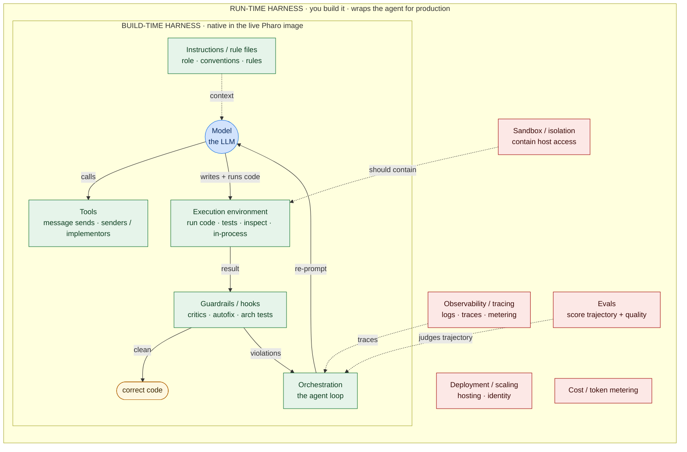
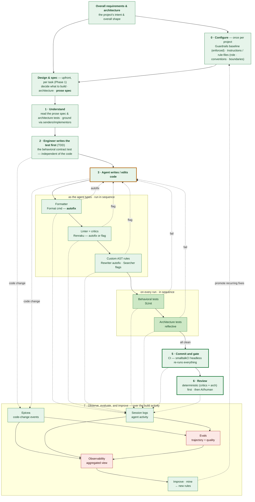

# Engineering the Pharo Environment for Agentic Coding — v2
### A Pharo-native adaptation of Florian Buetow's *Beyond Coding* playbook, reconciled with the harness framing of Google's *New SDLC with Vibe Coding*

## Table of contents

- [The harness, split — what Pharo gives you, what you still build](#the-harness-split--what-pharo-gives-you-what-you-still-build)
- [Context engineering — the six types, in Pharo](#context-engineering--the-six-types-in-pharo)
- [Rosetta map — guide concept → Pharo mechanism](#rosetta-map--guide-concept--pharo-mechanism)
- [Phase 1 — Shift the hard work upfront](#phase-1--shift-the-hard-work-upfront-start-here--the-part-that-stays-human)
- [Phase 2 — Add architectural guardrails](#phase-2--add-architectural-guardrails)
- [Phase 3 — Make behavior the feedback signal (TDD)](#phase-3--make-behavior-the-feedback-signal-tdd)
- [Phase 4 — Lay down deterministic guardrails](#phase-4--lay-down-deterministic-guardrails)
- [Phase 5 — Build the tightening loop](#phase-5--build-the-tightening-loop)
- [Phase 6 — Hand the feedback to the agent, not to yourself](#phase-6--hand-the-feedback-to-the-agent-not-to-yourself)
- [Evals — the non-deterministic half](#evals--the-non-deterministic-half-the-part-pharo-doesnt-hand-you)
- [Phase 7 — Delegate the review itself](#phase-7--delegate-the-review-itself)
- [Phase 8 — Scale to the team and set policy](#phase-8--scale-to-the-team-and-set-policy)
- [Cross-cutting practices](#cross-cutting-practices)
- [Summary — automate vs. keep human](#summary--automate-vs-keep-human-pharo)
- [If you only do one thing this week](#if-you-only-do-one-thing-this-week)

---

Buetow's playbook and Google's *New SDLC with Vibe Coding* paper reach the same conclusion from
opposite ends: **the model is one input; the *harness* around it — the rules, tools, sandbox,
feedback loops, observability — is what decides whether an agent actually finishes something.** The
paper compresses it to an equation, **Agent = Model + Harness**, and argues the harness is the large
majority of the surface area you actually control (*"most agent failures, examined honestly, are
configuration failures"*). This document is about **engineering that harness — in Pharo.**

Buetow assumes the agent runs in a **dumb, file-based world**, so you must *bolt* the harness on:
external formatter, external linter, external semgrep, external stop-hooks. **Pharo inverts that —
but only for one half of the harness, and it pays to be precise about which half.** Pharo is already
a live, reflective, object environment, so the **build-time** harness (rules, tools, execution environment, the
edit→check→fix cycle) largely *already exists* as first-class objects you **configure or query**
rather than build:

- the linter is a **living rule engine** (Renraku / Code Critics) — a "semgrep rule" is an
  object you add, and it can **auto-rewrite** the code, not merely flag it;
- mining for repeated corrections gains an image-native, code-side signal — **Epicea**, where
  every change is already an event object (alongside the agent's own session logs);
- "architecture tests" are **reflective queries** over a system that *is* a queryable object
  graph — you ask the classes, you don't parse files;
- the agent **runs inside the live image** — evaluating code, running tests, following senders,
  even fix-and-resume at a breakpoint — a tighter loop than any file hook could give.

The honest qualifier the paper forces: that inversion is real for the **build-time harness** and
*not* for the **run-time harness**. The distinction is *making the code correct* versus *running the
agent dependably in production*, and the two are worth pinning down because they are easy to conflate:

- The **build-time harness** is everything the agent uses *while writing and correcting code until it
  is right*: run code, run the tests, follow senders/implementors to understand the codebase, fix at
  the breakpoint, and the deterministic guardrails (critics, architecture tests). Its output is
  **correct code**, and in Pharo it is **native** — it all happens in the live image.
- The **run-time harness** is everything required to *run that agent reliably for real users at
  scale*: observability and tracing, **evals** (judging the non-deterministic part — was the
  trajectory sound, does the output pass a quality rubric), deployment and scaling, and cost/token
  metering. Its output is **a dependable production service**, and in Pharo you **build it
  yourself**; the image does not provide it.

Two boundaries are easy to misplace, so state them outright. First, *improving* the harness — mining
repeated corrections into new rules (Phase 5, the tightening loop) — is itself mostly **build-time**
work; the run-time harness is about *operating* the agent, not *improving* it. Second, **quality
straddles the line**: deterministic correctness (tests pass, critics clean) is build-time, but
non-deterministic *quality* — a sensible trajectory, a good answer by a rubric — is run-time, because
judging it needs evals. The next two sections make both tiers explicit — the table immediately below
tags every harness component **build-time** or **run-time** — before the phases begin.

---

## The harness, split — what Pharo gives you, what you still build

Taking *Agent = Model + Harness* literally and walking the paper's own harness inventory, here is
which pieces Pharo hands you (configure/query) versus which remain ordinary engineering (build):

| Harness component | In Pharo | Harness tier |
|---|---|---|
| **Instructions / rule files** | Renraku rule `rationale` strings · class/package comments · a `House-Rules` package · the agent's system prompt | build-time — **native** |
| **Tools** | message sends; reflective queries (senders / implementors / references) are on-demand tools the agent calls into the live graph | build-time — **native** |
| **Execution environment** | the image runs code in-process — evaluate, run tests, inspect — no external runner | build-time — **native** |
| **Sandbox / isolation** | **not** native — the image has full host access (files, OS processes, sockets, FFI), even in dev; real containment (OS-level sandbox, restricted image, capability limits) is something you build | run-time — **build it** |
| **Guardrails / hooks** | Renraku critics (live badge) + **`RBParseTreeRewriter` autofix** + reflective architecture tests | build-time — **native** |
| **Orchestration logic** | the agent's own loop; sub-agents as separate headless workers logging to distinct transcripts | build-time — **partly build** |
| **Observability / tracing** | Epicea (change events) + transcripts give the *trajectory record*; production-grade tracing/metering is **not** in the image | run-time — **build it** |
| **Evals (trajectory + quality)** | the raw material exists (Epicea + transcripts); the eval *harness* — task sets, rubrics, LM judges — is **not** native | run-time — **build it** |
| **Deployment / service / scaling** | image deployment exists, but production agent hosting/identity/scaling is not the image's job | run-time — **build it** |
| **Cost / token metering** | not native — *but* reflection is a token **lever** (pull the exact slice, not whole files; see next section) | run-time — **build it** |

The same split as an operating picture — the model plus its **build-time** harness (green) live inside
the live image; to run the agent for real you wrap them in the **run-time** harness (red), the part
Pharo does *not* give you. The green loop is how the agent operates; the red layer is what production adds:



The honest version of the inversion: Pharo **collapses the build-time harness into the live image**,
so you *configure* the part the file world *bolts on*. But the **run-time harness** — observability
at scale, evals, deployment, cost — is the same build in Pharo as anywhere, and the image does not
shrink it. Don't let the build-time magic convince you the run-time harness is free; it isn't, and the
**evals** gap below is the most important instance.

---

## Context engineering — the six types, in Pharo

The *New SDLC* paper makes **context engineering** the central skill: what the agent knows upfront
versus what it retrieves on demand, across six context types. Almost everything in this document
lives in *one* of those six (Guardrails + verification). Here is where the **other five** live in
Pharo — and why the live image is an unusually strong context substrate, not just a code editor:

| Context type (per *New SDLC*) | File-world home | Pharo home |
|---|---|---|
| **Instructions** (role, goals, boundaries) | `AGENTS.md` / `CLAUDE.md` | a `House-Rules` package + rule `rationale` strings + the system prompt |
| **Knowledge** (docs, diagrams, domain data) | retrieved docs / RAG | class & package comments · Microdown docs · a **Moose/FAMIX** model of the codebase to query |
| **Memory** (session + persistent state) | session logs + a store | the **live image *is* persistent state**; **Epicea** is the change log; transcripts are session memory |
| **Examples** (few-shot, reference patterns) | few-shot prompt blocks | **example methods** (`<example>` / `<sampleInstance>` ⟨verify⟩) — runnable *and* demonstrative at once |
| **Tools** (APIs, scripts, services) | tool defs / MCP | message sends + **reflective queries** (senders / implementors / references) as on-demand tools |
| **Guardrails** (hard constraints, validations) | semgrep / hooks | **Renraku rules + `RBParseTreeRewriter` + architecture tests** — the bulk of this doc |

**Static vs dynamic context — an honest account of where Pharo helps.** The paper flags the
static-vs-dynamic boundary as a real trade-off: static context is always loaded (every token present
every turn); dynamic context is retrieved on demand (you pay only when needed). The tempting contrast
— *file agents pre-load the repo, Pharo retrieves on demand* — is **false** and should be retired: a
competent file agent already retrieves on demand too, via `grep`/ripgrep and, better, a language
server's find-references / find-implementations / go-to-definition, which answers *"who sends this?
who implements it? what references this class?"* **semantically** for mainstream typed languages —
exactly as Pharo's `senders` / `implementors` do (from the method dictionaries rather than a typed
index). So the genuine advantages are narrower than "Pharo retrieves, files don't":

- **Zero plumbing.** Running in the image, `#charge implementors` or `SystemNavigation default
  allSendersOf: #processPayment` ⟨verify-in-image⟩ are just code the agent evaluates; the file world
  must first *build* the equivalent into the harness (LSP integration, or grep tools). This is the
  build-time-harness-is-native point again, applied to retrieval.
- **Always live, never textual.** A language server relies on an index that can go stale, and falls
  back to noisy textual `grep` where it is weak or absent (dynamic languages, broken builds, partial
  parses). Pharo's queries run against already-compiled methods in the running image — always
  current, no build step, and never a string-coincidence match.
- **Runtime *state*, not just code.** The genuinely unique move, and a *different kind* of context
  than the senders/implementors examples above: the agent can inspect a live object's actual field
  values, evaluate an arbitrary expression against the running system, or halt at a breakpoint and
  read the live stack — which no static file tool can retrieve at all.

So Pharo's dynamic-context edge is real but specific — **zero-plumbing, always-live navigation plus
runtime-state introspection** — not a generic "retrieves on demand where files can't."

**The token-economy angle, with the same caveat.** The paper's economics section argues for a
*dense, high-signal payload* over a sprawling one, and a single sender list or implementor set is
exactly that — so reflection helps OpEx **against the naïve habit** of pasting whole files (or a
package's source) and letting the model search them. It is **not** a saving over a file agent that
already retrieves surgically with a language server, whose find-references is just as dense. Real
where it replaces "paste it all"; a wash against a disciplined file agent.

**The caveat that keeps Memory trustworthy.** The live image is also a context *hazard*: a long-lived
image accumulates stale globals and half-finished experiments the agent can trip over. The same
persistence discipline below (don't let the image drift from disk) is what keeps the **Memory**
context honest rather than a source of phantom state.

**The image/disk reality, stated up front.** The agent runs *in the image* — that's the premise
here, and it's why the build-time cycle is so tight: the rules, tests, and reflective queries all live exactly
where the agent works, with no external hook to relay results through. The one genuine discipline is
**persistence**: a running image is not the system of record, so the agent's work has to be committed
to disk as **Tonel** (via Iceberg/Git) for durability, version control, CI, and review — and a
long-lived working image should be kept from drifting away from what's committed. That's ordinary
hygiene, not a tax on the loop.

Exact class and selector names drift between Pharo versions; anything version-sensitive below is
marked **⟨verify-in-image⟩**. The *mechanisms* are stable; the *spellings* you should confirm.

---

## Rosetta map — guide concept → Pharo mechanism

The guide layers land at different moments in a task, so before the per-component detail, here is
**when** each fires across a typical Pharo agent task. Steps 3 and 4 are shown in full: writing code
triggers each check *in sequence*, and every check either **autofixes in place** or **flags/fails and
routes back to writing code** — the stop-hook loop repeating until the whole chain is clean:



At the top, **Overall requirements & architecture** — the project's intent and overall shape — feeds
both the once-per-project **Configure** (guardrails, instructions) and each task's **Design & spec**, so
one project intent shapes both the enforced baseline and every per-feature spec.

**Two clocks — read the diagram by task order.** These step numbers are *task chronology* (the order
within one piece of work), not the **Phase** numbers of the sections below, which are Buetow's
*adoption* order — the maturity a team grows through (guardrails first, spec-discipline later). That is
why **Design & spec** carries *(Phase 1)* yet sits first: doing the upfront design well is a
later-maturity habit, but within any task it *opens* the work. It is where the **prose spec** is
created, per feature — which is what Step 1 then reads. The **architecture tests** it points at are the
durable Phase-2 asset (read here, run at Step 4, extended when this task adds a constraint), and the
**behavioral spec** is *not* read here — it is written at Step 2 as the contract test.

On autofix — *no, they are not all autofix*, which is exactly why the steps split. The **formatter**
always rewrites and continues. A **Renraku rule** — a built-in critic *or* a custom AST rule —
autofixes only when it carries a transformation: an **`RBParseTreeRewriter`** rewrites in place, but an
**`RBParseTreeSearcher`** or a flag-only critic can only *flag*, and routes back to the agent to fix.
**Tests never autofix** — a red behavioral test or a failed architecture test always routes back. Only
when the entire sequence is clean does the code proceed to commit. (In Pharo the *linter* and *critics*
are one engine, Renraku, and the *semgrep* equivalent is just custom Renraku rules — which is why the
four file-world tools collapse into the two check nodes shown.)

Colour marks the tier from the split diagram: green is build-time work in the image (lighter = the
as-you-type checks of Step 3, darker = the on-run checks of Step 4; bold amber border marks *write
code*, the hub every check returns to; bold-bordered Steps 5–6 are the verification gate), amber fill
is the part you build rather than get for free — here the eval judge and the observability view.

**Step 7 is a layer over the build activity, not a step after it.** Nothing here is a "deployed agent
running a task" — the whole diagram *is* the agent doing a task — so Step 7 does **not** follow Step 6;
it watches Steps 2–4. The code the agent writes flows into **Epicea** (Pharo's change-event log); each
check — formatter, critics, custom AST rules, behavioral and architecture tests — does two things at
once: it **feeds its result back to *write code*** (closing the build loop) and **emits to the session
logs** (as do the commit/gate and review steps). Those two records — Epicea and the logs — feed the **Evals** (which score trajectory and
quality) and the **Observability** view (which aggregates the records *and* the eval results); and the
aggregate feeds **Improve** — mine for recurring corrections and promote them into the Step 0 baseline.
Green marks what is **native** (Epicea, the logs, and the mine→rules loop — Buetow's Phase 5); amber
marks what you **build** (the eval judge and the observability view). One nuance: Epicea captures
*every* change, but what mining acts on is the recurring corrections — an autofix is a change, not a
lesson.

Grouped by the **harness component** each guide layer implements. Every row gives the layer's
purpose, the file-based tool it corresponds to, and the Pharo-native mechanism.

### Guardrails / hooks — deterministic constraints, enforced the moment code is written

| Guide layer | Purpose / scope | File-based tool | Pharo-native mechanism |
|---|---|---|---|
| Formatter | Normalize layout so style is never a review topic and diffs stay meaningful | Prettier / Black | the **Format** command · `RBFormatter` ⟨verify⟩ |
| Linter | Flag known anti-patterns and smells the moment they appear | ESLint / Ruff | **Renraku** · the **Critic Browser** / Quality Assistant |
| semgrep AST rules | Turn a specific recurring objection into a structural pattern — and auto-fix it | semgrep patterns | **`RBParseTreeSearcher`** (match) + **`RBParseTreeRewriter`** (fix), as **Renraku rules** |
| "scope to my code" | Apply rules only to code you authored, sparing vendored/framework code | git-blame script | method **author stamps** (`Author fullName`, `method stamp`) ⟨verify⟩ |
| Architecture tests | Enforce structural boundaries (layering, allowed dependencies) as hard constraints | ArchUnit / dep-cruiser | **reflective SUnit tests** over `SystemNavigation`, or **Moose/FAMIX** for serious analysis |
| Shared team guardrails | Ship one hardened rule set so every project starts from the same baseline | shared config repo | a **house-rules package** via a Metacello **`BaselineOf`** |

### Eval & Testing — verify what was built, and how it got there

| Guide layer | Purpose / scope | File-based tool | Pharo-native mechanism |
|---|---|---|---|
| Behavioral tests (TDD) | Make behavior the correction signal — deterministic pass/fail on inputs and outputs | Jest / pytest | **SUnit** (the original xUnit) · **DrTests** runner · coverage tools |
| Evals (trajectory + quality) | Judge the *non-deterministic* part — right trajectory, tool choices, output quality | eval framework + LM judge | **no native home** — build over Epicea/transcripts (see *Evals* below) |

### Orchestration logic — the loop that runs the agent and routes failures back

| Guide layer | Purpose / scope | File-based tool | Pharo-native mechanism |
|---|---|---|---|
| Stop hook + loop | Keep the agent working until the goal is met, not until it first stops | shell hook + Ralph/`goal` | in-image **agent bridge** (live eval + resume) |
| CI enforcement | Re-run the whole gate headless on every change and block on red | GitHub Actions + tool | **smalltalkCI** (baseline · SUnit + critics · coverage) |

### Observability / tracing — see what the agent actually did, and feed it back

| Guide layer | Purpose / scope | File-based tool | Pharo-native mechanism |
|---|---|---|---|
| Mine session logs | Find repeated corrections and promote them into new rules | parse `~/.claude` | **agent session logs** **+** **Epicea** change events (`EpMethodModification`, …) ⟨verify⟩ |

### Instructions / rule files — who the agent is, its conventions and boundaries

| Guide layer | Purpose / scope | File-based tool | Pharo-native mechanism |
|---|---|---|---|
| Conventions the agent reads | State the stack, conventions, and workflow the agent should follow — guidance it *reads*, distinct from the *enforced* guardrails above | `AGENTS.md` / `CLAUDE.md` | a `House-Rules` doc · rule **`rationale`** strings · class/package **comments** |

**On requirements & specs — where they live.** Both source docs treat detailed requirements and specs
as first-class: the New SDLC paper makes *intent specification* the hallmark of agentic engineering
(Table 1) and gives Requirements its own SDLC phase, and Buetow centers Phase 1 on the upfront
design/spec work. So they matter — the earlier draft's error was only about *where they sit*. Specs
are not a harness **component**; they are an **activity**, and in this doc that activity is **Phase 1
(shift the hard work upfront):** decide what to build, the architecture, and the specs — the
**Design & spec** step that opens each task in the lifecycle above. The spec then
takes concrete Pharo form, most-to-least formal: the **architecture spec** as executable dependency
tests (**Phase 2**), the **behavioral spec** as the SUnit suite (**Phase 3**) — the precise, executable
contract the paper frames as how tests communicate intent to the agent — and **prose
requirements/intent** as Microdown and class/package comments (**Knowledge** context the agent reads).
The only genuine mis-mapping was on the harness axis: specs are **not** the *Instructions* component
(that paper's Instructions is *role, conventions, boundaries* — the `AGENTS.md` analog), and comments /
`<example>` methods / Microdown are **Knowledge and Examples** context, not a component of their own.

**Reading the groups.** Two patterns, both echoing the split table above. Most guide layers implement
**Guardrails / hooks** — the component Pharo makes most native, which is why the playbook concentrates
there. And five harness components have **no guide-layer at all**: *Tools* and *Execution environment*
(native and invisible — message sends and the image itself, nothing to configure), plus *Sandbox /
isolation*, *Deployment*, and *Cost* — the run-time harness a playbook aimed at producing correct code
never needs to cover.

---

## Phase 1 — Shift the hard work upfront *(start here — the part that stays human)*

Own **understanding and architecture**; automate implementation. In Pharo:

- Decide exactly what you're building, then **sketch the architecture** — packages, classes, the
  messages each sends — and **encode it as the Phase-2 dependency tests** so the design is
  executable, not just a diagram.
- Treat **specs as shared understanding, not code.** Pharo gives you good homes: **class and
  package comments**, **example methods** (`<example>` / `<sampleInstance>` pragmas ⟨verify⟩) that
  double as living documentation *and* runnable smoke tests, and Microdown for prose. A fine-grained
  *behavioral* spec (the tests) matters more than a beautiful spec document.
- **Prototype first** — and here Pharo shines: the **Playground** is the prototyping environment.
  Vibe-code the shape live, discover the right objects, *then* lock the spec and pin the
  architecture tests.

> ⚠️ The intensity moves up front — the hard thinking before the code, not discovered along the
> way. That's the new normal, and it's what pushes you toward product-level thinking.

**Move on when:** you can reason confidently about how the components talk, and implementation is
genuinely the automated part.

---

## Phase 2 — Add architectural guardrails

Pharo's advantage here is structural: the program **is** an object graph, so dependency tests are
**reflective queries**, not file parsing — they run instantly because they execute no logic, just
inspect references.

```smalltalk
TestCase subclass: #ArchitectureTest package: 'House-Rules-Tests'.

ArchitectureTest >> testUiDoesNotReachIntoPersistence
    "The UI layer must go through business logic — never touch persistence classes directly."
    | persistence offenders |
    persistence := (RPackage organizer packageNamed: 'MyApp-Persistence') definedClasses asSet.
    offenders := OrderedCollection new.
    (RPackage organizer packageNamed: 'MyApp-UI') methods do: [ :m |
        "referenced classes of a compiled method — confirm the exact API in your image"
        (m literals select: [ :lit | lit isBehavior ])              "⟨verify-in-image⟩"
            do: [ :ref | (persistence includes: ref instanceSide)
                ifTrue: [ offenders add: m ] ] ].
    self assert: offenders isEmpty
        description: 'UI reaches into Persistence directly: ', offenders printString.
```

Pin allowed package dependencies as a set of these tests. When you let the agent design something
and its diagram shows a weird interconnection, **encode prevention as one more test**. For serious
architecture work (cycles, layering, metrics across a large system), **Moose/FAMIX** builds a full
model of the codebase you can query and visualize with Roassal — the heavyweight Pharo-native
option beyond hand-written reflective tests.

**Move on when:** architecture violations fail fast and automatically, so the agent can't quietly
wire your system into spaghetti.

---

## Phase 3 — Make behavior the feedback signal (TDD)

This is home turf: **SUnit is the original xUnit**, written in Smalltalk; TDD is native culture in
Pharo. But *who* writes the tests matters, and the two sources pull opposite ways — worth resolving.

The safeguard is **independence**: a test is a check only if it is independent of the implementation.
If one agent writes the test *and* the code from the same understanding, a misreading lands in both and
they agree — a green suite that proves nothing. So split the tests by role:

- **Contract tests — the human owns these, first.** The behavioral test that defines "correct" for the
  feature is the contract. The *New SDLC* paper is explicit: *write the tests and evals before
  generating the code; together they are the contract with the AI.* Author them before the agent
  implements — Step 2 of the lifecycle above. (Buetow leans the other way — he puts *behavioral test
  generation* on the automate side and calls small auto-generated tests "trustworthy" — but even he
  keeps *validating specs and behavior* human, so validating the generated contract test before the
  agent codes against it is the floor; authoring it yourself is stronger.)
- **Coverage tests — the agent may generate, you review.** Edge cases and property-based tests are
  where AI generation earns its keep (the paper: *agents produce cases humans miss*), and Buetow's
  reliability point holds — a small test generates far more reliably than a whole subsystem. Expand
  coverage with the agent, then read what it wrote.

Buetow's "trustworthy even when auto-generated" is about generation *reliability*, not *independence*:
a reliably-generated test the same agent then implements against is still not an independent check.
Auto-generate coverage freely; do not auto-generate the contract and the code in one pass.

Turn **every fixed bug into a test**; the **DrTests** runner gives fast feedback and coverage tooling
shows where the agent under-tested. Because tests run in-image, the agent (via the Phase-6 bridge) runs
them itself between edits — corrected by a suite whose contract you own.

**Move on when:** the agent is corrected by a test suite whose *contract you wrote or validated*, not
by you reading diffs.

---

## Phase 4 — Lay down deterministic guardrails

**Formatter & linter are already in the box.** Wire the **Format** command to run on save and
turn on the **Code Critics** for your package (Calypso shows the critique badge live; the
**Critic Browser** runs a rule set over a whole package). No installation — they ship.

**The "semgrep rule" is the high-value move, and Pharo does it better.** semgrep matches an AST
pattern; Pharo's `RBParseTreeSearcher` matches AST patterns with meta-variables, and
`RBParseTreeRewriter` *rewrites* them — semgrep-autofix, but native and more powerful. Backtick
`` ` `` introduces a sub-pattern; `` `@ `` matches any node or list.

```smalltalk
"Encode a real objection as an AST search — e.g. the 'swallowed error' anti-pattern
 (an empty on:do: handler). Run it ad hoc, in a test, or package it as a Renraku rule."
| searcher hits |
searcher := RBParseTreeSearcher new.                              "⟨verify-in-image⟩"
searcher
    matches: '`@guarded on: `@err do: [:`@e | ]'   "empty handler block"
    do: [ :node :answer | answer add: node ; yourself ].
hits := OrderedCollection new.
(RPackage organizer packageNamed: 'MyApp') methods
    do: [ :m | searcher executeTree: m ast initialAnswer: hits ].   "⟨verify⟩"
hits   "=> the methods that swallow errors"
```

```smalltalk
"The autofix superpower: not 'flag it' but 'fix it'. Rewrite isNil ifTrue: -> ifNil:."
| rewriter |
rewriter := RBParseTreeRewriter new.
rewriter replace: '`@x isNil ifTrue: [`@block]' with: '`@x ifNil: [`@block]'.
"apply to a method's tree, recompile the result — the agent's mistake is corrected automatically"
```

Then **promote the search into a live rule** so it shows up in the Critic Browser and the
editor badge (subclass the Renraku rule base — confirm the exact base and hook in your image):

```smalltalk
ReNodeMatchRule subclass: #HouseNoSwallowedErrorRule       "⟨verify-in-image⟩ base + hooks"
    package: 'House-Rules'.
HouseNoSwallowedErrorRule >> name      ^ 'Swallowed error (empty on:do: handler)'.
HouseNoSwallowedErrorRule >> severity  ^ #error.
HouseNoSwallowedErrorRule >> rationale
    ^ 'Do not swallow errors — propagate, or handle explicitly and say why. Rewrite so the '
    , 'failure surfaces. (Project policy.)'.
```

**Note on the guide's examples.** "Ban default parameter values" doesn't apply — Smalltalk
keyword messages have no defaults. The *category* (ban a foot-gun via a rule) still holds; pick
Pharo-relevant targets instead: no `self halt`/`Transcript show:` left in committed domain code,
no `perform:` with a literal selector (use a real send), no `Smalltalk at:put:` global writes, no
`become:` in app code, no empty `ifTrue:`/`ifNil:` blocks.

**Scope to your own code.** Filter by author stamp so your rules apply only to methods you wrote
(`method stamp`/`Author fullName` ⟨verify⟩) — the Pharo equivalent of the guide's "did I author
this file" script.

**Move on when:** your house rules run automatically (badge + Critic Browser), at least one is an
**autofix**, and you've felt the correction load drop.

---

## Phase 5 — Build the tightening loop

In Pharo, "add a guardrail" is **add an object** — subclass a rule, implement the hook, it's
live in the browser immediately. The reflex is even cheaper than in a file world.

**Mine two logs, not one.** The agent's own session logs still exist — mine them exactly as the
guide says: point the agent at its history to find where you reminded it of the same thing more
than once. Pharo then adds a *second*, code-side signal: **Epicea** records every change as a
queryable event, so you can also ask your own change history which methods you rewrote repeatedly.
Conversation churn and code churn are different lenses on the same recurring correction — turn
either into a rule.

```smalltalk
"Sketch: tally methods that were modified many times in recent history (rewrite churn)."
| log counts |
log := EpMonitor current log.                                    "⟨verify-in-image⟩"
counts := Bag new.
(log entries select: [ :e | e content isKindOf: EpMethodModification ])   "⟨verify⟩"
    do: [ :e | counts add: e content affectedSelector ].
counts sortedByCount first: 20   "=> your most-corrected methods → candidate rules"
```

Capture team PR feedback the same way: a recurring review comment becomes a Renraku rule (or an
`RBParseTreeRewriter` that fixes it on sight). A reusable analysis can live as a **skill**.

**Move on when:** tightening the environment is a habit, and the rule set is drifting toward how
*you* think Pharo should look.

---

## Phase 6 — Hand the feedback to the agent, not to yourself

Because the agent runs in the image, this loop is largely already closed — the agent runs the
checks where they live. Two layers, primary → enforcement:

**Primary — the agent runs the checks itself, in the image.** It evaluates a snippet, runs a test,
asks for senders/implementors of a selector, reads a rule's `rationale` string (which *is* the
prompt you'd otherwise have typed) — and, the part no file language can match, **resumes a halted
computation after fixing the method that broke** (the same superpower called out in the LLM-client
design: an unhandled case opens the debugger at the failing frame, the agent writes the missing
method, hits *Proceed*, and the call continues into the new code). The latency is "ask the image →
get the exact failure → fix → continue," not "finish → hook → re-read." Where the harness reaches
the image over a bridge or MCP server, this is the default loop.

**Enforcement — smalltalkCI on the committed code.** The durable gate runs headless on what's been
pushed to disk: load the baseline, run SUnit + critics, fail on red tests *or* on `#error`-severity
criticisms so style violations also block. This is your CI gate, and the fallback for any step that
edits Tonel files directly instead of working in the image. Use smalltalkCI rather than hand-rolling
the load-and-run; pair it with a loop (a Ralph loop or the `goal` command) when you drive it from
outside.

```bash
#!/usr/bin/env bash
# guardrails.sh — smalltalkCI loads + checks the committed code (CI gate / file-editing fallback)
set -e
if smalltalkCI .smalltalk.ston; then exit 0; fi   # runs SUnit (+ critics if configured)
echo "GUARDRAILS FAILED — read the rule rationales above."
echo "Fix every violation, then finish. Do not stop until tests are green and critics are clean."
exit 1
```

**Move on when:** the agent fixes formatter/critic/test complaints on its own and you've stopped
relaying them by hand.

---

## Evals — the non-deterministic half *(the part Pharo doesn't hand you)*

Phase 3's tests verify the **deterministic** part: given this input, that output. The *New SDLC*
paper insists that is only half the verification story, and the other half is what separates agentic
engineering from vibe coding for the *non-deterministic* dimension: **evals** check whether the agent
took the **right trajectory of steps, chose the right tools, and produced output that meets the
quality bar** — scored by labelled datasets, rubrics, and LM judges. *"Without both, the practice is
always vibe coding, regardless of how sophisticated the prompts are."* This doc has been strong on
tests and silent on evals; here is the honest Pharo picture, which is the clearest case of where the
build-time harness ends and the run-time harness begins.

The paper distinguishes two, and they land very differently in Pharo:

- **Output eval** — the final artifact: does it compile, do the tests pass? **Pharo covers this
  natively.** It is exactly your deterministic gate (critics + SUnit, headless via smalltalkCI). Nothing
  new to build.
- **Trajectory eval** — the *sequence* of tool calls and intermediate reasoning. Here Pharo is half
  lucky, half exposed:
  - **The raw material is unusually good.** The agent's "tool calls" *are* message sends, and
    **Epicea** plus the agent's transcripts already record what it did, in order — a recorded
    trajectory most file-based setups have to instrument for deliberately.
  - **The judgment is not native.** Whether that trajectory was *good* is not a question SUnit
    answers. Trajectory eval needs a scoring **rubric** and usually an **LM judge**, run against a
    labelled set of representative tasks and tracked as a regression over time. That harness — task
    sets, rubric, judge, score history — is **image-external** and **not** something Pharo gives you.
    It is the same build in Pharo as in any stack.

What to actually do:

- Treat **output eval as already covered** — it is your existing headless gate; don't rebuild it.
- For **trajectory and quality eval**, build a small harness at the **run-time** tier: a set of
  representative tasks, run the agent **headless**, capture its trajectory (Epicea events + the
  transcript) and its final image state, then **score with a rubric** — task success, selector/tool
  choice quality, whether it **grounded claims in the image** (senders/implementors it actually
  checked) versus asserting from prose, hallucinated selectors or packages, and response quality —
  using an **LM judge** wherever the criterion is non-deterministic. Run it in CI alongside
  smalltalkCI, the way the paper says to gate agent shipping on **eval coverage with an explicit
  rubric**, not on a passing demo.
- **Honest bound.** This is the one place the file-world tooling (mature eval frameworks) is as far
  along or further, and where Pharo's build-time advantages **do not transfer**. The image gives you
  an excellent trajectory *record*; it does not give you the *judge*. Budget for building the judge.

**Move on when:** you can answer *"does this agent succeed **reliably**, and does it get there the
right way?"* with a number from an eval suite — not a vibe from one demo.

---

## Phase 7 — Delegate the review itself

Stack the two kinds of review in cost order: **deterministic first (free), judgment second.** The
deterministic tier in Pharo is unusually strong — critics + reflective architecture tests + SUnit
all run headless in seconds and produce precise locations. Run that first; it clears the
mechanical issues for nothing. Then a **specialized review agent** scans what's left for a specific
architectural style you're enforcing, and its output is a **triage map** telling you where to look
as a human. You engage only on the genuinely ambiguous or non-deterministic — which, note, is
exactly the surface your **trajectory evals** above are meant to keep honest at scale.

**Move on when:** your review time goes to architecture/behavior decisions, not line-by-line
scanning a machine could do.

---

## Phase 8 — Scale to the team and set policy

- **Ship guardrails as a package.** Put the house rules + architecture tests in a `House-Rules`
  package and have every project's **Metacello `BaselineOf`** depend on it, so new projects start
  **pre-hardened**. This is cleaner than a shared config repo — it's code, versioned and loaded like
  any dependency. Treat the **eval rubric** and **context files** (the Instructions/Knowledge of the
  previous section) as the same kind of shared, versioned asset.
- **Enforce in CI with smalltalkCI** (GitHub Actions etc.): it loads the baseline headless, runs
  SUnit + critics, reports coverage, fails the build. Gate agent-facing changes on **eval coverage**
  too, not just tests — the paper's "set the bar at the eval, not the demo."
- **Tier critical vs non-critical** (the Amazon model: senior review required for critical systems
  after AI-caused outages). Decide which packages get the strictest critic severity and mandatory
  human review. The guardrail of last resort still applies: *don't YOLO the billing package.*
- **Lead with measurement.** Converting skeptics is hard; show that work goes faster with less
  babysitting — and, per the paper's economics, that the harness drives **OpEx** down (denser
  context, fewer correction loops, cheaper models on deterministic tasks), not just velocity up.

**Move on when:** the team has a shared, tiered review policy and a growing shared guardrail
package.

---

## Cross-cutting practices

- **The harness matters more than the model — and in Pharo the harness is split** (see *The harness,
  split* above): the build-time harness is native, the run-time harness is yours to build. The same frontier model
  is far more capable with a **live reflective bridge** (run code, query senders, resume at a
  breakpoint) than with Tonel-files-only access. If you must standardize on one tool, find what *it*
  is best at and use it there; don't bet a five-year strategy on a single harness.
- **Run several projects at different rigor levels:** one pure-Playground/vibe image, one
  TDD/behavioral-spec project, one multi-package system you analyze with Moose. Add features with
  different methods, watch what the agent gets wrong, and **promote anything weird into your
  per-language house-rules package** so the next project starts harder.
- **Get introspection into orchestration.** Sub-agents hide their hand-offs; run them as **separate
  headless workers** logging to distinct transcripts so you can watch where they start to deviate —
  often at the first exchange. Those transcripts are also the **trajectory record** your evals score.
- **Interrogate the model before trusting it.** Start complex tasks with *"tell me your understanding
  of what we're building"* — and, uniquely in Pharo, have it **ground that understanding in the image**
  (list the senders of this selector, show the implementors of this method) so misreadings surface
  against reality, not just prose. This is dynamic context retrieval *and* a cheap correctness check.
- **Protect against burnout and "cognitive surrender."** Interleave tasks within one project (treat
  building the agent's environment as a parallel sub-project) rather than hard-switching while you
  wait. Keep **ownership** — don't let the agent take the wheel — and, Pharo-specific, **don't let the
  image drift from disk** while you wait: a divergent image is its own quiet debt (and a corrupted
  **Memory** context for the next step).

---

## Summary — automate vs. keep human (Pharo)

| Automate (engineer into the image) | Keep as human responsibility |
|---|---|
| Format command + Code Critics on save | Knowing *exactly* what you're building |
| House Renraku rules + `RBParseTreeRewriter` autofixes | Designing the architecture & message flow |
| Reflective dependency/boundary tests (or Moose) | Reasoning about how the system fits together |
| SUnit generation + bug→test capture (output eval) | Validating specs and behavior |
| Trajectory capture (Epicea + transcripts) for evals | Designing eval rubrics & judging non-deterministic quality |
| Dynamic context via reflection (senders/implementors on demand) | Deciding what belongs in *static* context (the `House-Rules` / `AGENTS.md` boundary) |
| First-pass review (critics + arch tests, then AI scan) | Final judgment on ambiguous/critical changes |
| smalltalkCI loop until green (headless or in-image) | Ownership and accountability for outcomes |

---

## If you only do one thing this week

Pick **one real PR objection** and encode it as an `RBParseTreeRewriter` (so it *fixes*, not just
flags), then promote it to a Renraku rule so the badge lights up live in the browser. Run it across
your package, let the agent work inside that tighter image, and watch the correction load drop.
That fast win is what makes every later phase worth the effort — and the autofix is the moment
Pharo stops feeling like a worse file-editor and starts feeling like the programmable environment
the whole playbook is reaching for. (Once that lands, the highest-value *next* thing is the **eval
harness** above — it's the half the image doesn't give you, and the half that separates a reliable
agent from a good demo.)

---

*Adaptation of Florian Buetow (AI Engineer, Xebia) on the* Beyond Coding *podcast, retargeted to
Pharo 13's live, reflective toolchain and reconciled with the harness / context-engineering / evals
framing of Google's* The New SDLC with Vibe Coding *(Osmani, Saboo, Kartakis, 2026). Version-sensitive
class and selector names are marked ⟨verify-in-image⟩; confirm them against your image.*


--- 

---
---


They line up almost one-to-one — the diagram already encodes the three tiers as its three visual bands (T3, T4, S5/S6). The mapping:

| Rosetta Step | Our Tier | Mechanism | Scope | Verdict Counts? |
| --- | --- | --- | --- | --- |
| 0 · Configure | (precondition) | guardrails.ston + registry, once per project | — | — |
| Design/1/2 · spec, test-first | (the work order) | Work order carries the test skeletons — the human-owned contract of Step 2 | The chunk | — |
| T3 · "as the agent types" | Tier 1 · edit | Renraku badge / rule engine on the method just written; autofix or flag, route back to write | Touched methods | No — assistance |
| T4 · "on every run" | Tier 2 · chunk | Agent runs suites / in-image gate between edits; verdicts streamed; integrator's verify command at handoff | Chunk tests + regression guard; local checks may scope | Advisory — gates the handoff, not the build |
| S5 · "commit and gate" | Tier 3 · enforcement | CI adapter runs full registry against the committed artifact, always | Everything registered | Yes — the only authoritative verdict |
| S6 · review | Tier 3 output | Gate report attached to the reviewer prompt; judgment spent only past the machine tier | — | — |
| S7 · observe/improve | out of v1 | Epicea mining is R-34 (v1-widen); evals are out of scope | — | — |

**Three observations about the fit:**

1. **The two-clock distinction is already in the source.** The diagram's caption for S5 is literally our tier 3 ("smalltalkCI headless re-runs everything"), and Phase 6's primary-vs-enforcement split is exactly advisory-in-the-image (T3/T4) vs. authoritative-on-the-committed-code (S5). My three tiers didn't add a concept — they made explicit which scope each band needs and why, which the diagram leaves implicit.
2. **The one insertion the method makes:** The diagram goes agent → commit; the prompt-suite method puts the integrator's verify between them. This is effectively a per-chunk rehearsal of S5, because chunks are the method's commit unit. Also, its "fail → route back to write" arrows are our streamed-first-red reaction, and its "≤2 fix round-trips then escalate" is the method's bound on how many times that arrow may fire.
3. **Two deliberate v1 deviations from the diagram:** T3's formatter node is out of the gate entirely (format-at-write belongs to the write_method); and T4's ordering (behavioral before architecture) is arbitrary for us. Registry order runs lint → architecture → behavioral, which changes nothing since all registered checks must pass.

**Summary:** Tier 1 = the diagram's light-green as-you-type band, Tier 2 = the darker on-every-run band plus the method's integrator checkpoint, Tier 3 = the bold-bordered commit/review gate. The diagram's flow survives intact; what the spec adds on top is the scoping law and the placement of the counting verdict at the one band no agent controls.